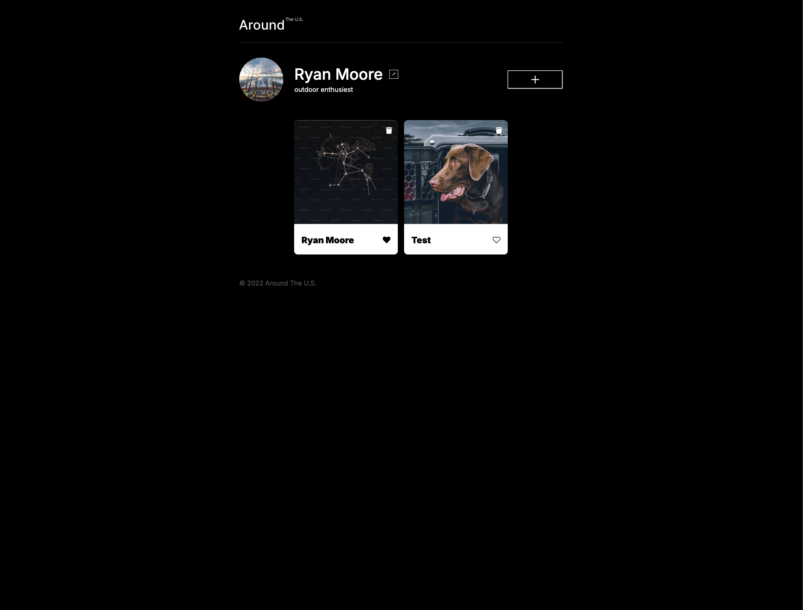

# Project 3: Around The U.S.

Around the U.S. project is the first project where we had to look at a Figma design and code it from that.

## Table of Contents

- [Project Overview](#project-overview)
- [Features](#features)
- [Screenshots](#screenshots)
- [Links](#links)
- [Deployment Instructions](#deployment-instructions)
- [System Requirements](#system-requirements)

## Project Overview

This project showcases several essential features and techniques utilized to create a responsive web layout:

- **HTML5**: The backbone of the structure.
- **CSS**: Styling the elements for a visually appealing design.
- **JavaScript OOP**: Implemented to manage project functionality and enhance code organization.
- **CSS Grid & Flexbox**: Used for flexible and responsive layouts.
- **BEM (Block Element Modifier)**: A methodology for naming conventions to maintain a modular and maintainable CSS structure.

## Features

- Responsive design that adapts to various screen sizes, including mobile, tablet, and desktop.
- Maximum width set to **1280px** and minimum width to **320px** for optimal display across devices.
- Able to like and unlike, add, remove images
- able to update profile avatar

## Screenshots

### Desktop

### Add Card

### Update Profile

## Links

- **[Figma Design](https://www.figma.com/file/ii4xxsJ0ghevUOcssTlHZv/Sprint-3%3A-Around-the-US?node-id=0%3A1)**: View the original design file for layout and style references.
- **[Live Project on GitHub Pages](https://moorek11c.github.io/se_project_aroundtheus/)**: Explore the deployed version of the project.

## Deployment Instructions

To deploy this project locally, follow these steps:

1. **Clone the repository** to your local machine:
   bash

2. **npm install**

3. **npm Run Build**

4. **npm run dev**

5. Open your project and go to [localhost](http://localhost:8080)

## System Requirements

**Following is required**:
• core-js: Version 3.23.5
